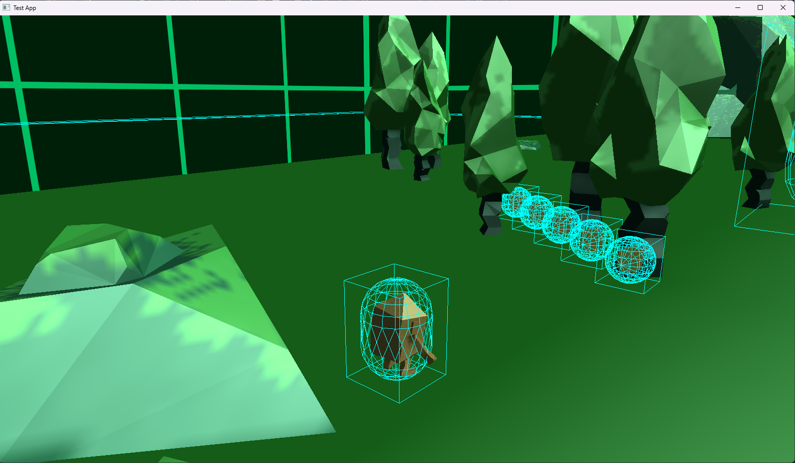
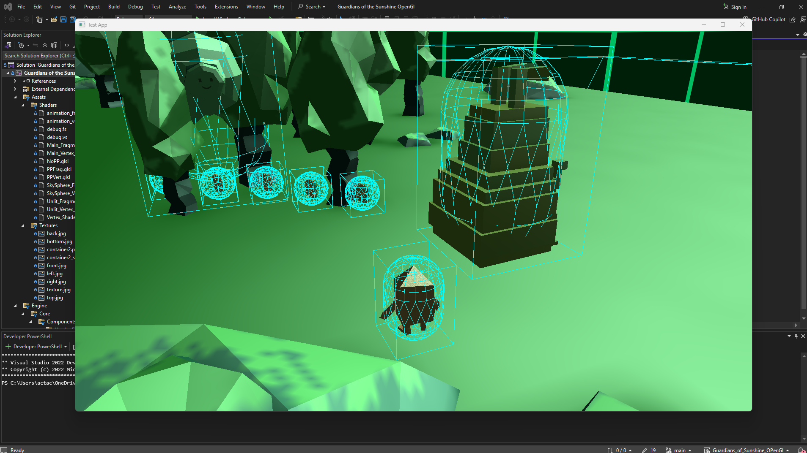
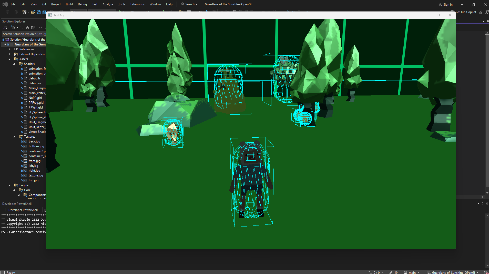
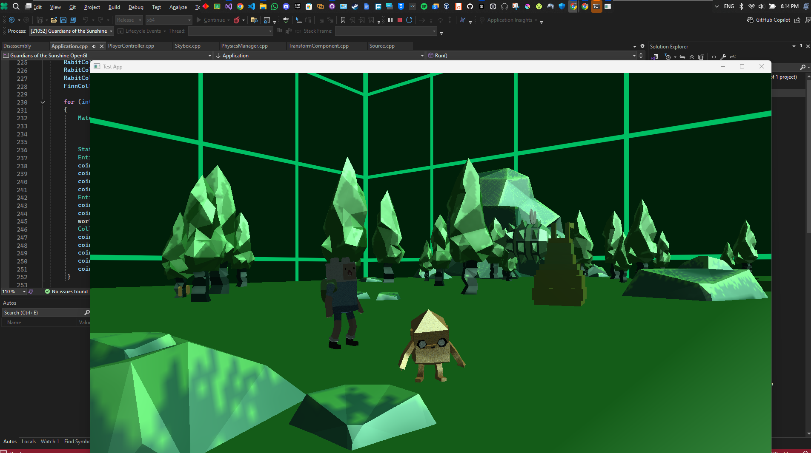

* **OpenGL 3.3–3.8** compatibility (depending on hardware)
* **No UI system** (so I’ve removed references to pixel-art UI, overlays, or ImGui)
* A clear focus on the **engine architecture and technologies**
* The **"Guardians of Sunshine"** game is now strictly presented as a demo for showcasing engine capabilities

---

# Guardians\_of\_Sunshine\_OpenGL Engine

### 🛠️ **Engine Overview**

This is a lightweight, custom-built 3D game engine written in **C++** using **OpenGL 3.8**. It supports modern rendering pipelines and real-time physics, with an emphasis on modular, extensible architecture. The engine was built from scratch and powers a demo game, *Guardians of Sunshine*, to showcase its core capabilities.

---

### 🚀 **Engine Features**

#### 🎮 **Core Systems**

* **Entity-Component System (ECS)**
  Flexible composition of game objects using components like `Transform`, `MeshRenderer`, `RigidBody`, `Collider`, and `Animator`.

* **Scene Graph & Level Serialization**
  Hierarchical object transforms with scene loading from **JSON** files for easy asset configuration and level creation.

* **Input Handling**
  Basic keyboard/mouse input through GLFW, configurable via code.

---

#### 🖥️ **Rendering Pipeline**

* **OpenGL 3.8 Core Profile**
* **Forward Rendering** pipeline with:

  * Per-fragment lighting (Directional, Point, and Spotlights)
  * Shadow mapping
* **Shader System**: Custom GLSL shaders with modular, runtime-uniform management
* **Low-Poly Support**: Ideal for retro-style games
* **Skybox Rendering**
* **Model Animation**: Skeletal animation using vertex skinning

---

#### ⚙️ **Physics & Collision**

* **ReactPhysics3D Integration**

  * Rigid body dynamics (dynamic, kinematic, and static)
  * Multiple collider shapes (box, sphere, capsule)
  * Collision filtering and event callbacks

* **Physics Debug Rendering**
  Toggleable wireframe visualization of physical bodies and collision volumes.

---

#### 🎨 **Asset & Resource Management**

* **Model Importing via Assimp**
  Supports `.obj` and `.dae` formats

* **Texture Loading via stb\_image**
  PNG, JPG formats with mipmaps and filtering

* **Audio System via OpenAL**
  3D spatial audio and background music playback

* **Scene Definition**
  Level and object data defined using human-readable JSON files

---

### 🕹️ **Demo Game: Guardians of Sunshine**

The demo game built on this engine is inspired by the *Adventure Time* episode "Guardians of Sunshine." It demonstrates:

* Third-person action gameplay
* Character abilities (bomb-throwing, jumping, combo attacks)
* Basic AI behavior
* Coin pickups and enemy interaction
* Retro-inspired visuals and animations

> *This game exists only to demonstrate the functionality of the engine.*

---

### 📸 **Screenshots (Engine In-Game Captures)**

---

### 🧪 **Technologies Used**

| Tech                    | Description                          |
| ----------------------- | ------------------------------------ |
| **C++**                 | Core engine language                 |
| **OpenGL 3.8**          | Rendering API                        |
| **GLFW**                | Windowing, input, OpenGL context     |
| **GLM**                 | Math (vectors, matrices, transforms) |
| **Assimp**              | 3D model importing                   |
| **ReactPhysics3D**      | Physics simulation                   |
| **OpenAL**              | Audio playback                       |
| **stb\_image**          | Image loading                        |
| **JSON for Modern C++** | Level and asset configuration        |

---

### 🖼️ **Visual References**

These images are concept and visual inspiration from the *Adventure Time* episode and art style:

---
