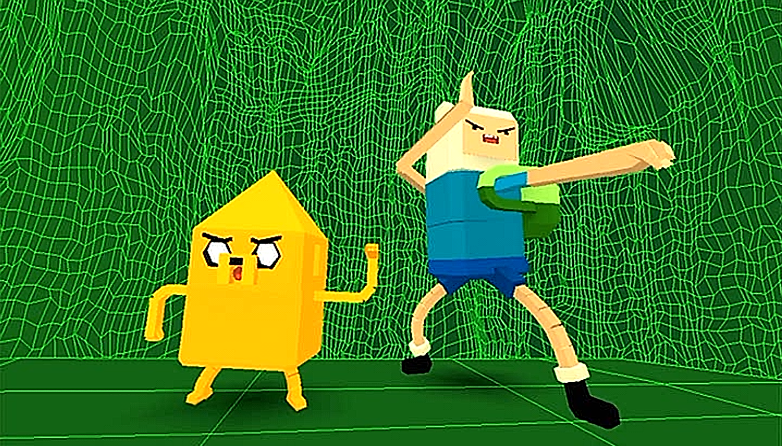
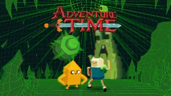
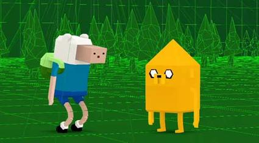
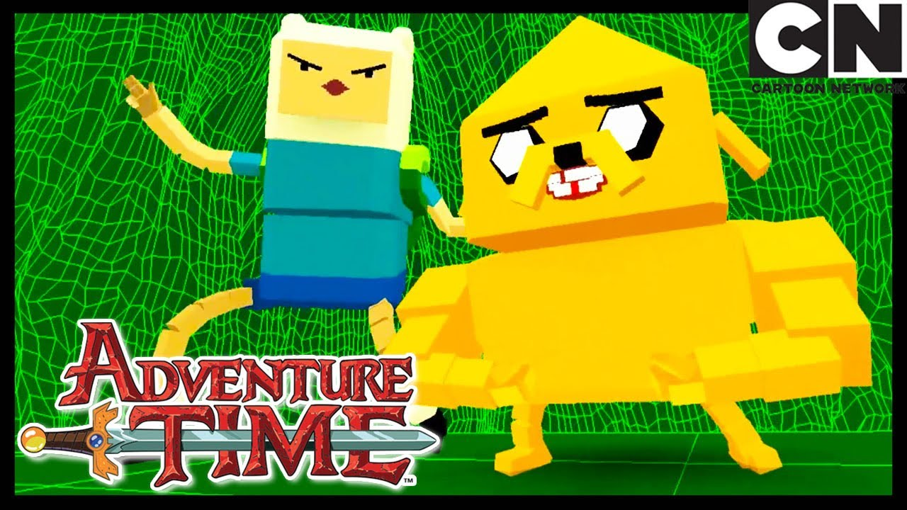

# Guardians_of_Sunshine_OpenGl

### **Game Overview**:  
"Guardians of Sunshine" is a 3D action-adventure game where the player navigates a vibrant, interactive world inspired by the Adventure Time episode. The primary objectives are to collect coins, defeat enemies, and face challenging boss battles, all while exploring a fantastical environment.
---
### **Refrence Images**:

### **Key Features**:

#### 1. **Dynamic Gameplay**  

  - *Finn*: lumps, throws bombs, does combo move
  - *Jake*: Just followers Finn around, no one has time to rig and animate shape shifting
 - Use teamwork to overcome obstacles, solve puzzles, and defeat enemies.

#### 3. **Retro-Pixel Aesthetics**  

- vibrant green retro low poly 3D environments and Characters
- Pixel art UI

#### 4. **Enemies**  

  - *Sleepy Sam*: Boss
  - *Bouncy Bee*
  - *Gnome Knight*

#### 5. **Powers**  

- Throwing a bomb at the enemy
- Jumping over pits
- Combo move

#### 6. **Level Design**  
- a level where the player tries to evade or defeat all the enemies without maxing out their extra lives and leave the cave
- Boss Levels
---

### **Gameplay Mechanics**:

#### **Combat**:  
- Throwing a bomb at the enemy
- Jumping over pits
- Jumping over the enemies head
- Combo move

#### **Collectibles**:  
- shiney golder coins can be collected along the way

#### **Obstacles**:
- Lava pits
-Monsters
---

### **Art Style & Soundtrack**:  
- **Graphics**: low poly environment and characters
- **Soundtrack**: the original sound track from the referenced episode
---

